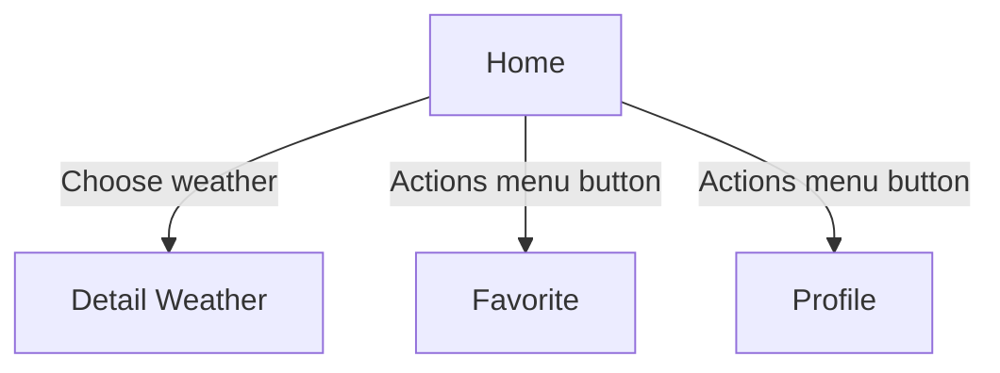

# **Nalssi**  


Nalssi is a simple weather list application that displays the weather in the capital city of each province in Indonesia. This application also provides detailed weather information!  

> **Project Type**: Course Assignment (Personal Project)  
>  
> **Development Date**: January 2025  
>  
> **Role**: Mobile Developer (Android)  

## Technologies Used  

  

This application was developed using Git, GitHub, Android Studio, and Kotlin Jetpack Compose as the primary framework.  

## Challenges - Solutions - Impact  

The development of this application faced several challenges since this was my first Jetpack Compose application and involved implementing offline and online accessibility.  

### Challenges  

- Displaying the latest data from the API and rendering it.  
- Providing a favorite city feature and storing it in a database.  
- Structuring the code for future development.  

### Solutions  

- Used the Retrofit dependency to interact with the API.  
- Implemented swipe refresh to fetch the latest data.  
- Used Koin dependency injection to build the architecture.  
- Implemented Room Database to store favorite cities.
-  Attempted to implement NBR to fetch and synchronize data with local storage.  
  
  > For some reason, NBR is not working properly.  

### Impact  

- The application can be accessed both offline and online, but an internet connection is required the first time to fetch new data.  
- The application can successfully store favorite cities.  

## Lessons Learned  

From this project, I learned how to use Kotlin Jetpack Compose as a framework. This application taught me how to write more declarative code and use Koin dependency injection.  

- Improved my understanding of Kotlin and Jetpack Compose.  
- Helped me explore NBR (Network Bound Resource).  

# **Installation & Usage Guide**  

Installing and using this application is simple and quick. Users can follow the steps below to get started.  

## Installation  

The installation process involves a few basic steps to ensure the application runs smoothly on the user’s device.  

To get started with Nalssi, follow these steps:  

1.  **Clone the repository**:  

    ```sh
    git clone https://github.com/faradaii/nalssi.git  
    ```  
2.  **Navigate to the project directory**:  

    ```sh
    cd nalssi
    ```
3.  **Sync the project with Gradle and install dependencies**:  
    Ensure you have the correct SDK version installed (match it with `compileSdkVersion` in `build.gradle`).  

    - If using Android Studio:  

        - Open **File** > **Sync Project with Gradle Files** (or click the **Sync Now** button if available).  

    - For other environments, please refer to the specific setup instructions.  

4.  **Run the application**:  

    - In Android Studio:  

        Select an emulator or physical device > click the **Run** button (or press Shift + F10).  

    - For other environments, follow the appropriate instructions.  

## Usage  

This application is very simple; users can browse the weather list to get weather details.  



----------
